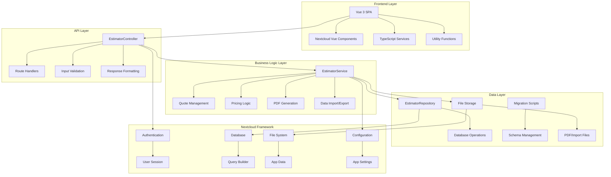

# Door Estimator Application - Design Document

## Overview

The Door Estimator Application is designed as a modern, scalable Nextcloud app that replaces Excel-based workflows with a professional web interface. The system follows Nextcloud's app framework standards while providing comprehensive door and hardware estimation capabilities with role-based access control, flexible pricing management, and professional quote generation.

## Architecture

### High-Level Architecture

The application follows Nextcloud's standard MVC architecture pattern with clear separation of concerns:



### Technology Stack

- **Frontend**: Vue 3 with Composition API, TypeScript, Vite build system
- **Backend**: PHP 8.0+, Nextcloud App Framework
- **Database**: MySQL/PostgreSQL via Nextcloud's database abstraction
- **File Storage**: Nextcloud's file system abstraction
- **PDF Generation**: TCPDF library
- **Import/Export**: PhpSpreadsheet for Excel/CSV processing

## Components and Interfaces

### Frontend Components

#### Main Application Component (App.vue)
- **Purpose**: Root component managing application state and navigation
- **Key Features**:
  - Tab-based navigation (Estimator/Admin)
  - Dark/light theme toggle
  - Toast notification system
  - Responsive layout management

#### Estimator Interface
- **Quote Builder**: Dynamic form sections for all product categories
- **Price Lookup**: Real-time price calculation and display
- **Section Management**: Collapsible sections with totals
- **Markup Controls**: Per-quote markup adjustment capabilities

#### Admin Interface
- **Pricing Data Grid**: Searchable, sortable pricing item management
- **Import/Export Tools**: File upload and download interfaces
- **Category Management**: Organization of pricing by product categories
- **Bulk Operations**: Mass update and validation tools

### Backend Controllers

#### EstimatorController
```php
class EstimatorController extends Controller
{
    // Pricing Management
    public function getAllPricingData(): JSONResponse
    public function getPricingByCategory(string $category): JSONResponse
    public function updatePricingItem(): JSONResponse
    public function searchPricing(): JSONResponse
    
    // Quote Operations
    public function saveQuote(): JSONResponse
    public function getQuote(int $quoteId): JSONResponse
    public function getUserQuotes(): JSONResponse
    public function deleteQuote(int $quoteId): JSONResponse
    public function duplicateQuote(int $quoteId): JSONResponse
    
    // PDF and Export
    public function generateQuotePDF(int $quoteId): JSONResponse
    public function importPricingData(): JSONResponse
    
    // Configuration
    public function getMarkupDefaults(): JSONResponse
    public function updateMarkupDefaults(): JSONResponse
    public function getOnboardingStatus(): JSONResponse
}
```

### Service Layer

#### EstimatorService
- **Pricing Management**: CRUD operations for pricing data with validation
- **Quote Processing**: Business logic for quote calculations and storage
- **PDF Generation**: HTML-to-PDF conversion with professional formatting
- **Data Import/Export**: Multi-format file processing with error handling
- **Markup Management**: Default and per-quote markup calculations

#### Key Service Methods
```php
class EstimatorService
{
    public function lookupPrice(string $category, string $item, ?string $frameType = null): float
    public function saveQuote(array $quoteData, array $markups, ?string $quoteName = null): int
    public function generateQuotePDF(int $quoteId): ?array
    public function importPricingFromUpload(array $uploadedFile): array
    public function calculateQuoteTotal(array $quoteData, array $markups): float
}
```

## Data Models

### Database Schema

#### Pricing Data Table (door_estimator_pricing)
```sql
CREATE TABLE door_estimator_pricing (
    id INT PRIMARY KEY AUTO_INCREMENT,
    category VARCHAR(50) NOT NULL,
    subcategory VARCHAR(100),
    item_name VARCHAR(255) NOT NULL,
    price DECIMAL(10,2) NOT NULL,
    stock_status VARCHAR(20) DEFAULT 'stock',
    description TEXT,
    created_at TIMESTAMP DEFAULT CURRENT_TIMESTAMP,
    updated_at TIMESTAMP DEFAULT CURRENT_TIMESTAMP ON UPDATE CURRENT_TIMESTAMP,
    INDEX idx_category (category),
    INDEX idx_item_name (item_name),
    INDEX idx_category_subcategory (category, subcategory)
);
```

#### Quotes Table (door_estimator_quotes)
```sql
CREATE TABLE door_estimator_quotes (
    id INT PRIMARY KEY AUTO_INCREMENT,
    user_id VARCHAR(64) NOT NULL,
    quote_name VARCHAR(255) NOT NULL,
    customer_info JSON,
    quote_data JSON NOT NULL,
    markups JSON NOT NULL,
    total_amount DECIMAL(12,2) NOT NULL,
    created_at TIMESTAMP DEFAULT CURRENT_TIMESTAMP,
    updated_at TIMESTAMP DEFAULT CURRENT_TIMESTAMP ON UPDATE CURRENT_TIMESTAMP,
    INDEX idx_user_id (user_id),
    INDEX idx_updated_at (updated_at)
);
```

### Data Transfer Objects

#### Quote Line Item
```typescript
interface QuoteLineItem {
    id: string;
    item: string;
    qty: number;
    price: number;
    total: number;
    frameType?: string; // For frame items only
}
```

#### Pricing Item
```typescript
interface PricingItem {
    id: number;
    category: string;
    subcategory?: string;
    item: string;
    price: number;
    stock_status: string;
    description?: string;
}
```

#### Quote Data Structure
```typescript
interface QuoteData {
    doors: QuoteLineItem[];
    doorOptions: QuoteLineItem[];
    inserts: QuoteLineItem[];
    frames: (QuoteLineItem & { frameType: string })[];
    frameOptions: QuoteLineItem[];
    hinges: QuoteLineItem[];
    weatherstrip: QuoteLineItem[];
    closers: QuoteLineItem[];
    locksets: QuoteLineItem[];
    exitDevices: QuoteLineItem[];
    hardware: QuoteLineItem[];
}
```

## Error Handling

### Error Classification

#### Client Errors (4xx)
- **400 Bad Request**: Invalid input data, validation failures
- **401 Unauthorized**: Authentication required
- **403 Forbidden**: Insufficient permissions (admin-only operations)
- **404 Not Found**: Quote or pricing item not found
- **413 Payload Too Large**: File upload size exceeded
- **429 Too Many Requests**: Rate limiting for import operations

#### Server Errors (5xx)
- **500 Internal Server Error**: Database failures, unexpected exceptions
- **503 Service Unavailable**: Temporary system unavailability

### Error Response Format
```json
{
    "success": false,
    "error": {
        "code": "VALIDATION_ERROR",
        "message": "Invalid input data",
        "details": {
            "field": "price",
            "reason": "Must be a positive number"
        }
    }
}
```

### Frontend Error Handling
- **Toast Notifications**: User-friendly error messages
- **Form Validation**: Real-time input validation with visual feedback
- **Retry Mechanisms**: Automatic retry for transient network errors
- **Graceful Degradation**: Fallback behavior when services are unavailable

## Testing Strategy

### Unit Testing

#### Frontend Tests (Jest + Vue Test Utils)
- **Component Testing**: Vue component behavior and rendering
- **Service Testing**: API service functions and data transformation
- **Utility Testing**: Price calculation and validation functions
- **Store Testing**: State management and reactive data

#### Backend Tests (PHPUnit)
- **Controller Testing**: API endpoint behavior and response formats
- **Service Testing**: Business logic and data processing
- **Repository Testing**: Database operations and query building
- **Validation Testing**: Input sanitization and validation rules

### Integration Testing

#### API Integration Tests
- **End-to-End Workflows**: Complete quote creation and management flows
- **Authentication Testing**: User session and permission validation
- **Database Integration**: Data persistence and retrieval accuracy
- **File Operations**: Import/export functionality and PDF generation

#### Frontend Integration Tests
- **User Workflows**: Complete user journeys from login to quote generation
- **Component Integration**: Inter-component communication and data flow
- **API Integration**: Frontend-backend communication and error handling

### Performance Testing

#### Load Testing Scenarios
- **Concurrent Users**: 25 simultaneous users creating quotes
- **Data Volume**: Thousands of pricing items with fast search
- **Quote Generation**: 30-50 quotes per day processing
- **Import Operations**: Large file imports without blocking

#### Performance Targets
- **Price Lookups**: < 500ms response time
- **Quote Calculations**: < 200ms for complex quotes
- **PDF Generation**: < 5 seconds for standard quotes
- **Search Operations**: < 300ms for pricing item searches

### Security Testing

#### Authentication and Authorization
- **Session Management**: Proper user session handling
- **Permission Enforcement**: Admin vs. user access controls
- **CSRF Protection**: Cross-site request forgery prevention

#### Input Validation and Sanitization
- **SQL Injection Prevention**: Parameterized queries only
- **XSS Prevention**: Input sanitization and output encoding
- **File Upload Security**: Type validation and size limits

## Deployment and Configuration

### Nextcloud App Structure
```
door_estimator/
├── appinfo/
│   ├── info.xml              # App metadata and dependencies
│   ├── routes.php            # API route definitions
│   ├── app.php               # App bootstrap
│   └── database.xml          # Database schema
├── lib/
│   ├── Controller/           # API controllers
│   ├── Service/              # Business logic services
│   ├── Repository/           # Data access layer
│   ├── Migration/            # Database migrations
│   └── Command/              # CLI commands
├── src/                      # Vue.js frontend source
├── js/                       # Compiled frontend assets
├── templates/                # PHP templates
├── vendor/                   # PHP dependencies
├── node_modules/             # Node.js dependencies
├── composer.json             # PHP dependency management
├── package.json              # Node.js dependency management
└── README.md                 # Documentation
```

### Configuration Management

#### App Settings (via OCP\IConfig)
- **Default Markups**: Configurable percentage values
- **File Upload Limits**: Maximum import file sizes
- **Performance Settings**: Cache timeouts and query limits

#### User Preferences
- **Theme Selection**: Dark/light mode preference
- **Default Quote Settings**: Preferred markup values
- **Interface Preferences**: Column visibility and sorting

### Database Migrations

#### Migration Strategy
- **Version-based Migrations**: Sequential numbered migrations
- **Rollback Support**: Down migrations for schema changes
- **Data Preservation**: Safe migrations that preserve existing data
- **Index Optimization**: Performance-focused index creation

#### Migration Example
```php
class Version001000Date20250124000000 extends SimpleMigrationStep
{
    public function changeSchema(IOutput $output, \Closure $schemaClosure, array $options)
    {
        $schema = $schemaClosure();
        
        if (!$schema->hasTable('door_estimator_pricing')) {
            $table = $schema->createTable('door_estimator_pricing');
            $table->addColumn('id', Types::INTEGER, ['autoincrement' => true, 'notnull' => true]);
            $table->addColumn('category', Types::STRING, ['length' => 50, 'notnull' => true]);
            // ... additional columns
            $table->setPrimaryKey(['id']);
            $table->addIndex(['category'], 'idx_category');
        }
        
        return $schema;
    }
}
```

## Security Considerations

### Authentication and Authorization
- **Nextcloud Integration**: Leverage existing user authentication
- **Session Management**: Use OCP\IUserSession for secure session handling
- **Role-based Access**: Admin vs. user permission enforcement
- **API Security**: Proper HTTP method restrictions and CSRF protection

### Data Protection
- **Input Sanitization**: All user input sanitized and validated
- **SQL Injection Prevention**: Exclusive use of parameterized queries
- **XSS Prevention**: Output encoding and Content Security Policy
- **File Upload Security**: Type validation, size limits, and content scanning

### Privacy and Data Handling
- **User Data Isolation**: Users can only access their own quotes
- **Data Encryption**: Sensitive data encrypted at rest (via Nextcloud)
- **Audit Logging**: Security events logged through Nextcloud's system
- **Data Retention**: Configurable retention policies for quotes and pricing history

## Performance Optimization

### Database Optimization
- **Indexing Strategy**: Optimized indexes for frequent queries
- **Query Optimization**: Efficient queries with minimal N+1 problems
- **Connection Pooling**: Leverage Nextcloud's database connection management
- **Caching Strategy**: Use OCP\ICacheFactory for frequently accessed data

### Frontend Optimization
- **Code Splitting**: Lazy loading of admin components
- **Asset Optimization**: Minified and compressed JavaScript/CSS
- **Caching Strategy**: Browser caching for static assets
- **Progressive Loading**: Incremental data loading for large datasets

### API Optimization
- **Response Caching**: Cache pricing data and configuration
- **Pagination**: Limit large result sets with pagination
- **Compression**: GZIP compression for API responses
- **Rate Limiting**: Prevent abuse of expensive operations

## Monitoring and Maintenance

### Logging Strategy
- **Application Logs**: Business logic events and errors
- **Security Logs**: Authentication and authorization events
- **Performance Logs**: Slow queries and response times
- **Integration Logs**: Nextcloud framework interactions

### Health Monitoring
- **Database Health**: Connection status and query performance
- **File System Health**: Storage availability and permissions
- **Memory Usage**: PHP memory consumption monitoring
- **Error Rates**: Application error frequency and patterns

### Maintenance Procedures
- **Database Maintenance**: Regular optimization and cleanup
- **File Cleanup**: Temporary file and old PDF cleanup
- **Log Rotation**: Automated log file management
- **Performance Tuning**: Regular performance analysis and optimization