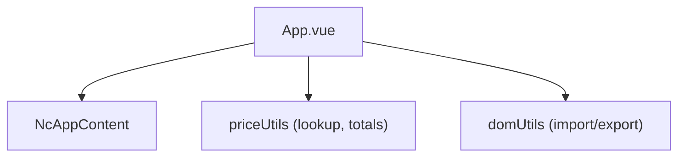
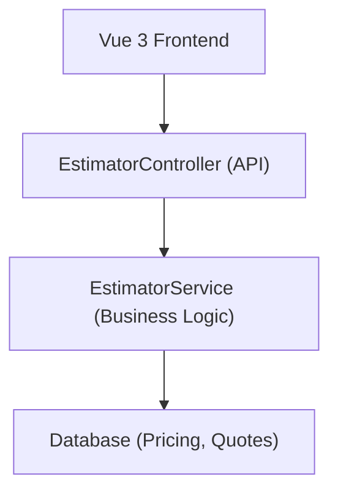
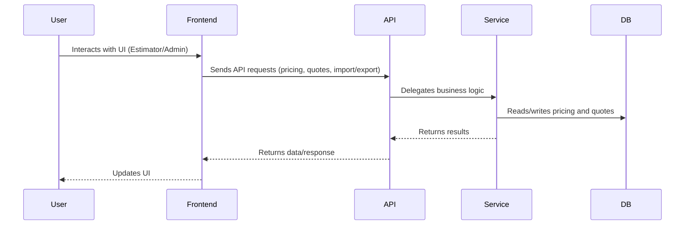

# Door Estimator App — Architecture Documentation

## Overview

The Door Estimator app is a modern Nextcloud application for professional door and hardware estimation. It replaces legacy Excel workflows with a robust web interface, leveraging a standardized project structure, Vue 3 frontend, modern PHP backend, Vite build system, and a normalized database schema.

---

## Standardized Project Structure & Design Decisions

The project follows Nextcloud’s recommended conventions for maintainability and scalability:

```
door-estimator/
├── appinfo/                # App metadata, routes, and config
├── lib/                    # PHP backend (controllers, services, migrations)
├── src/                    # Vue 3 frontend (Single File Components)
├── js/                     # Compiled JS output for Nextcloud
├── css/                    # Stylesheets
├── templates/              # PHP templates for Nextcloud integration
├── docs/                   # Documentation
├── scripts/                # Data import/export and setup scripts
├── tests/                  # Unit, integration, and frontend tests
```

**Design Decisions:**
- **Separation of Concerns:** Clear split between frontend (Vue 3) and backend (PHP), with business logic in the service layer.
- **Consolidation:** All UI logic is consolidated into [`src/App.vue`](src/App.vue:1), simplifying state management and component relationships.
- **Modern Conventions:** Uses Nextcloud’s attribute-based routing, Vite build system, and recommended directory layout.

---

## Frontend Architecture — Vue 3

The frontend is built as a single, consolidated Vue 3 SFC (`src/App.vue`), using the Composition API for reactive state and logic.

- **Tabs:** Estimator and Admin views, toggled via reactive state.
- **Sections:** Each product category (doors, frames, hardware, etc.) is a section, with dynamic tables and markup logic.
- **Dark Mode:** Toggleable, with responsive design.
- **Admin Panel:** Allows import/export of pricing data, with real-time updates.
- **Price Lookup & Markup:** Uses utility functions for price calculation and markup application.

**Component Relationships:**
- All UI logic is centralized in `App.vue`, with utility modules for price and DOM operations.
- State is managed reactively, with computed properties for totals.

### Mermaid Diagram: Component Relationships



---

## Backend Architecture — Modern PHP

The backend uses modern PHP 8+ features, including attributes for routing and OpenAPI documentation.

- **Controller:** [`lib/Controller/EstimatorController.php`](lib/Controller/EstimatorController.php:1) defines all API endpoints using attribute-based routing.
- **Service Layer:** [`lib/Service/EstimatorService.php`](lib/Service/EstimatorService.php:1) encapsulates business logic, database access, PDF generation, and import/export.
- **Repository:** Handles direct database queries and normalization.
- **Validation:** Robust input validation and error handling throughout.

### Mermaid Diagram: Backend Flow



---

## Vite Build System Configuration

The frontend build uses Nextcloud’s official Vite wrapper:

- **Config:** [`vite.config.js`](vite.config.js:1) sets up the main entry (`src/main.js`), CSS entry points, and license extraction.
- **Integration:** Output is compiled to `js/door-estimator.js` for Nextcloud to serve.
- **TypeScript:** All source code is in TypeScript, compiled via Vite.

---

## Database Schema Design

Defined in [`lib/Migration/Version001000Date20250124000000.php`](lib/Migration/Version001000Date20250124000000.php:1):

### `door_estimator_pricing`
- `id` (PK)
- `category` (e.g., doors, frames)
- `subcategory` (optional, e.g., frame type)
- `item_name`
- `price`
- `stock_status`
- `description`
- `created_at`, `updated_at`

### `door_estimator_quotes`
- `id` (PK)
- `user_id`
- `quote_name`
- `customer_info`
- `quote_data` (JSON)
- `markups` (JSON)
- `total_amount`
- `created_at`, `updated_at`

**Indices:** On category, subcategory, item_name, user_id, and created_at for performance.

---

## Migration: React to Vue 3 & Consolidation

See [`MIGRATION.md`](MIGRATION.md:1) for full details.

- **Rationale:** Vue 3 SFCs offer better developer experience, easier state management, and improved Nextcloud integration.
- **Process:** All React/TSX files were rewritten as Vue 3 SFCs. State and event logic migrated to Vue’s Composition API.
- **Testing:** All tests updated to use Vue Test Utils and Jest.
- **Consolidation:** All UI logic is now in `src/App.vue`, reducing complexity and improving maintainability.
- **Modern Conventions:** Attribute-based routing, service layer, and separation of concerns throughout.

---

## Application Flow Diagram



---

## References

- [src/App.vue](src/App.vue:1) — Vue 3 frontend, consolidated UI
- [lib/Controller/EstimatorController.php](lib/Controller/EstimatorController.php:1) — PHP API controller
- [lib/Service/EstimatorService.php](lib/Service/EstimatorService.php:1) — PHP service layer
- [lib/Migration/Version001000Date20250124000000.php](lib/Migration/Version001000Date20250124000000.php:1) — Database schema
- [vite.config.js](vite.config.js:1) — Vite build system config
- [MIGRATION.md](MIGRATION.md:1) — Migration details and rationale

---

## Separation of Concerns & Modern Nextcloud Conventions

- **Frontend:** All UI logic and state in Vue 3 SFCs, with utility modules for calculations and DOM operations.
- **Backend:** Attribute-based routing, service layer for business logic, repository for DB access.
- **Build:** Vite for fast, modern builds and TypeScript support.
- **Database:** Normalized schema for pricing and quotes, with migration scripts for setup.
- **Testing:** Comprehensive test suites for both frontend and backend.
- **Documentation:** All major architectural decisions and migration steps are documented for future maintainers.
