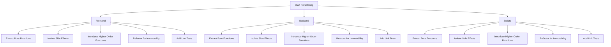

# Refactoring Plan for Nextcloud Door Estimator

## Frontend (js/door-estimator.js)

### 1. Extract Pure Functions
- **js/door-estimator.js**
  - Extract functions for DOM manipulation.
  - Extract functions for handling user inputs.
  - Extract functions for calculating estimates.

### 2. Isolate Side Effects
- **js/door-estimator.js**
  - Move API calls to separate service functions.
  - Move DOM manipulation to separate utility functions.

### 3. Introduce Higher-Order Functions
- **js/door-estimator.js**
  - Use higher-order functions for handling events and DOM updates.

### 4. Refactor for Immutability
- **js/door-estimator.js**
  - Use immutable data structures for state management.

### 5. Add Unit Tests
- **js/door-estimator.js**
  - Write unit tests for pure functions.
  - Write integration tests for DOM manipulation.

## Backend (lib/Controller/*.php, lib/Service/*.php)

### 1. Extract Pure Functions
- **lib/Controller/*.php**
  - Extract functions for handling API requests.
  - Extract functions for processing data.

- **lib/Service/*.php**
  - Extract functions for business logic.
  - Extract functions for data processing.

### 2. Isolate Side Effects
- **lib/Controller/*.php**
  - Move database operations to separate service functions.
  - Move file operations to separate utility functions.

- **lib/Service/*.php**
  - Move database operations to separate service functions.
  - Move file operations to separate utility functions.

### 3. Introduce Higher-Order Functions
- **lib/Controller/*.php**
  - Use higher-order functions for handling requests and responses.

- **lib/Service/*.php**
  - Use higher-order functions for processing data.

### 4. Refactor for Immutability
- **lib/Controller/*.php**
  - Use immutable data structures for state management.

- **lib/Service/*.php**
  - Use immutable data structures for state management.

### 5. Add Unit Tests
- **lib/Controller/*.php**
  - Write unit tests for pure functions.
  - Write integration tests for API endpoints.

- **lib/Service/*.php**
  - Write unit tests for pure functions.
  - Write integration tests for business logic.

## Scripts (scripts/extract_excel_python.py, scripts/setup.sh)

### 1. Extract Pure Functions
- **scripts/extract_excel_python.py**
  - Extract functions for reading Excel files.
  - Extract functions for processing data.

- **scripts/setup.sh**
  - Extract functions for setting up the environment.

### 2. Isolate Side Effects
- **scripts/extract_excel_python.py**
  - Move file operations to separate utility functions.

- **scripts/extract-excel-data.php**
  - Move file operations to separate utility functions.

- **scripts/setup.sh**
  - Move environment setup operations to separate utility functions.

### 3. Introduce Higher-Order Functions
- **scripts/extract_excel_python.py**
  - Use higher-order functions for processing data.

- **scripts/extract-excel-data.php**
  - Use higher-order functions for processing data.

- **scripts/setup.sh**
  - Use higher-order functions for setting up the environment.

### 4. Refactor for Immutability
- **scripts/extract_excel_python.py**
  - Use immutable data structures for state management.

- **scripts/extract-excel-data.php**
  - Use immutable data structures for state management.

- **scripts/setup.sh**
  - Use immutable data structures for state management.

### 5. Add Unit Tests
- **scripts/extract_excel_python.py**
  - Write unit tests for pure functions.
  - Write integration tests for file operations.

- **scripts/extract-excel-data.php**
  - Write unit tests for pure functions.
  - Write integration tests for file operations.

- **scripts/setup.sh**
  - Write unit tests for pure functions.
  - Write integration tests for environment setup.

## Recommended Sequence of Refactoring Steps

1. **Frontend**
   - Extract pure functions.
   - Isolate side effects.
   - Introduce higher-order functions.
   - Refactor for immutability.
   - Add unit tests.

2. **Backend**
   - Extract pure functions.
   - Isolate side effects.
   - Introduce higher-order functions.
   - Refactor for immutability.
   - Add unit tests.

3. **Scripts**
   - Extract pure functions.
   - Isolate side effects.
   - Introduce higher-order functions.
   - Refactor for immutability.
   - Add unit tests.

## Mermaid Diagram

