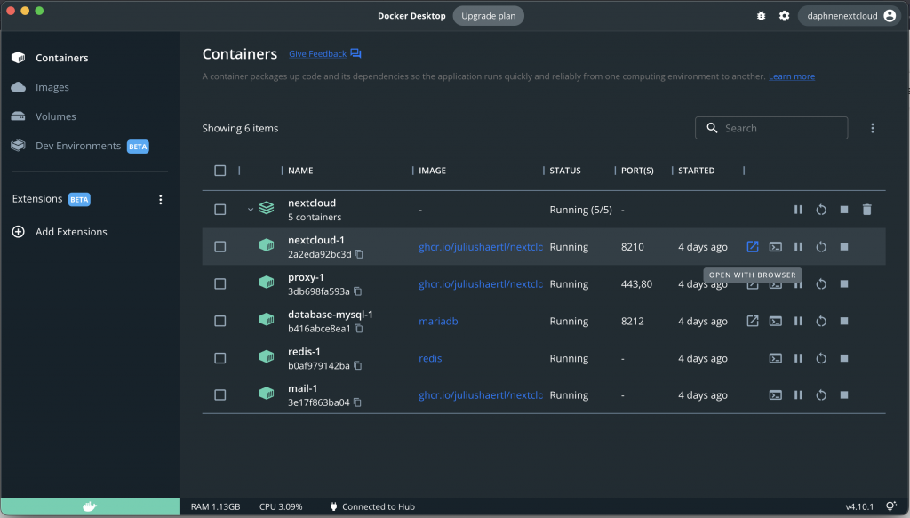

# Install the Nextcloud Docker image

::: info
A screen recording of this tutorial is available in the folder where you found this file.

However, since docker-compose is now shipped with the base docker installation, you no longer have to separately install docker-compose.

:::

### 1: Run the Nextcloud docker commands

Go to the GitHub page of the Nextcloud docker development environment: <https://github.com/juliushaertl/nextcloud-docker-dev>

Scroll down to the section "Persistent development setup" and in the section with the commands, you see two commands (see screenshot below) Each command has an icon on the top-right (see the arrows in the screenshot below). If you click this icon, it will copy the command to your clipboard.

Copy the first command.

Go to the terminal, and paste the first command. Press the **enter** key on your keyboard to run the command. Once the command has finished, copy and run the second command.

*Information about these commands:*

- The first command will first retrieve the code from GitHub and install the docker.
- At some point you may be asked in the terminal to fill in the **password** of the admin account of your computer. When you type in your password, do not be confused, because you will not see the characters appear on your screen. But it still works.
- During the process you might see a wealth of colorful warnings rolling over the screen. Don't be discomforted, everything is fine.
- This entire process can take much longer than you expect, if you think the process is frozen, it is probably not frozen. Be patient! For me it took about 20 minutes on a very fast internet.
- The second command is done if you see some lines about "long lost child came home!", see screenshot:

  

### 2: Access your Nextcloud in the browser

Access your Nextcloud by going in your browser to <http://nextcloud.local>

Loading the page can take a bit longer than expected, for me it took about half a minute.

If <http://nextcloud.local> does not work, there is an alternative way. See screenshot below.

1. Open the docker app.  
   If you don't see the icon in your dock bar, the app might be started in minimized mode which means you can find an icon in the menu bar at the top of your screen.
2. Go to **containers**
3. Unfold the container called "**master**" (for some older versions of the script this might also be called "nextcloud" like in the screenshot below) by clicking on the small arrow next to "master",

There is one entry that says something like "**nextcloud-1**" or "nextcloud_master_1", and on the right you see 5 icons. If you hover with your mouse over the first icon on the left, it says "open with browser". Click on that icon. Your Nextcloud will open in your browser.

### 

3: Log into your Nextcloud

If you are asked to update, you can simply click the button "start update", followed by "continue to Nextcloud".

If you see a login screen, log in through using the username **admin** and password **admin**  
(The user ID and password are the same for all users, as this is how the Docker container is configured.)