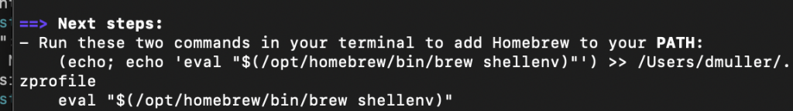

# 1 Mac install nvm

::: info
In this tutorial, we will first introduce nvm, which is a Node Version Manager. Through nvm we will install [Node.js](https://en.wikipedia.org/wiki/Node.js) and [npm](https://en.wikipedia.org/wiki/Npm), which are tools you need for running and compiling JavaScript.

It is possible to install Node.js and npm without nvm, but as you might need different versions of Node.js/npm depending on the project you are working on, it is much more convenient to be able to quickly switch between versions thanks to nvm.

:::

### Prerequisites

We assume you already have Xcode installed because this was one of the required steps in the tutorial on setting up a development environment.

### Step 1: Install Homebrew

Run the following in your terminal to install the package manager Homebrew.

```
/bin/bash -c "$(curl -fsSL https://raw.githubusercontent.com/Homebrew/install/HEAD/install.sh)"
```

Enter your administrator password if prompted and press **Enter/Return** to continue. Wait for the download to finish.

When the download is finished, run the step as described in the terminal to add Homebrew to your PATH. See screenshot:



### Step 2: Install nvm

Run the following command to install the Node Version Manager nvm. This will also add a new directory called `nvm` and add a necessary line into our `.zshrc` file in our home folder.

```
brew update
brew install nvm
mkdir ~/.nvm

echo "export NVM_DIR=~/.nvm\nsource \$(brew --prefix nvm)/nvm.sh" >> .zshrc
source ~/.zshrc
```

Then, run the following to see which version of nvm you have installed:

```
nvm -v
```

### Step 3: Install Node.js and npm

Run the following to install the latest LTS (Long-Term Support) versions of Node.js and npm:

```
nvm install --lts
```

Run the following to start using this version:

```
nvm use --lts
```

Check if you have npm installed by running the following:

```
npm -v
```

You should see a version number output to the terminal.

Check if you have Node.js installed by running the following:

```
node -v
```

You should see a version number output to the terminal.

### Troubleshooting

For some people, nvm might refuse to install (Step 2). An alternative chain of commands without using Homebrew is:

```
curl -o- https://raw.githubusercontent.com/nvm-sh/nvm/v0.40.1/install.sh | bash
source ~/.bashrc
source ~/.zshrc
```