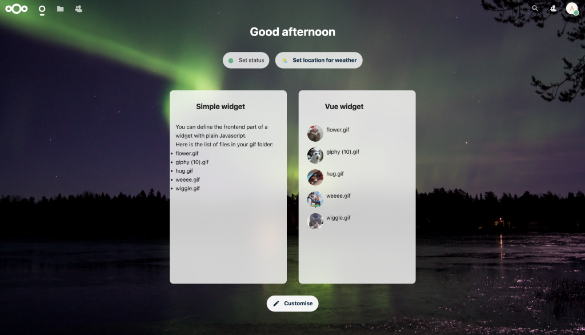

## Part 2: Create a dashboard widget using Vue.js components

::: info
**Introduction to Vue.js:**

On top of HTML we can load scripts that read and write HTML content. Front-end scripts (in JavaScript) are programs that run in the browser. With JavaScript it is hard to make complex things in an elegant way, for example, it is hard to, organize and reuse features and pieces of code. With Vue.js, you can do this.

With Vue.js you can create components (like a dashboard widget in our case) that you can take and put everywhere you want (even in other pages, so you could if you want to also use a dashboard widget component into any other page of your choice). Components are a combination of other components, HTML elements, scripts and style. So you can use components in other components.

Each component has a template (the HTML), a script section and a style section.

Vue.js is the recommended framework for front-end development of Nextcloud apps. Using Vue.js also makes it easy for developers to use components implemented by others, like the ones from the Nextcloud Vue library.

In the next steps we will create a second dashboard widget using the `NcDashboardWidget` component (from the Nextcloud Vue library).

:::

### 1. Declare the dashboard widget

- First, implement the dashboard widget. Create the file `lib/Dashboard/VueWidget.php` and set its content to:

  ```php
  <?php
  
  declare(strict_types=1);
  
  namespace OCA\CatGifsDashboard\Dashboard;
  
  use OCA\CatGifsDashboard\AppInfo\Application;
  use OCA\CatGifsDashboard\Service\GifService;
  use OCP\AppFramework\Services\IInitialState;
  use OCP\Dashboard\IAPIWidget;
  use OCP\IL10N;
  use OCP\IURLGenerator;
  use OCP\Util;
  
  class VueWidget implements IAPIWidget {
  
  	/** @var IL10N */
  	private $l10n;
  	/**
  	 * @var GifService
  	 */
  	private $gifService;
  	/**
  	 * @var IInitialState
  	 */
  	private $initialStateService;
  	/**
  	 * @var string|null
  	 */
  	private $userId;
  
  	public function __construct(IL10N $l10n,
  								GifService $gifService,
  								IInitialState $initialStateService,
  								?string $userId) {
  		$this->l10n = $l10n;
  		$this->gifService = $gifService;
  		$this->initialStateService = $initialStateService;
  		$this->userId = $userId;
  	}
  
  	/**
  	 * @inheritDoc
  	 */
  	public function getId(): string {
  		return 'catgifsdashboard-vue-widget';
  	}
  
  	/**
  	 * @inheritDoc
  	 */
  	public function getTitle(): string {
  		return $this->l10n->t('Vue widget');
  	}
  
  	/**
  	 * @inheritDoc
  	 */
  	public function getOrder(): int {
  		return 10;
  	}
  
  	/**
  	 * @inheritDoc
  	 */
  	public function getIconClass(): string {
  		return 'icon-catgifsdashboard';
  	}
  
  	/**
  	 * @inheritDoc
  	 */
  	public function getUrl(): ?string {
  		return null;
  	}
  
  	/**
  	 * @inheritDoc
  	 */
  	public function load(): void {
  		if ($this->userId !== null) {
  			$items = $this->getItems($this->userId);
  			$this->initialStateService->provideInitialState('dashboard-widget-items', $items);
  		}
  
  		Util::addScript(Application::APP_ID, Application::APP_ID . '-dashboardVue');
  		Util::addStyle(Application::APP_ID, 'dashboard');
  	}
  
  	/**
  	 * @inheritDoc
  	 */
  	public function getItems(string $userId, ?string $since = null, int $limit = 7): array {
  		return $this->gifService->getWidgetItems($userId);
  	}
  }
  ```

::: info
This file is very similar to the `lib/Dashboard/SimpleWidget.php` file.

:::

- Then, register the dashboard widget in the `lib/AppInfo/Application.php` file. Replace both occurrences of `SimpleWidget` in the file with `VueWidget`. The affected lines should look like those below:

  Line 7:

  ```php
  use OCA\CatGifsDashboard\Dashboard\VueWidget;
  ```

  Line 21 (register method):

  ```php
  $context->registerDashboardWidget(VueWidget::class);
  ```

### 2. Front-end

- Write the JavaScript source file for the Vue dashboard widget. This is the file that will be loaded in the dashboard page! The `VueWidget` class will load this file.

  Create the `src/dashboardVue.js` file and set its content to:

  ```js
  import Vue from 'vue'
  import './vueBootstrap.js'
  import GifWidget from './views/GifWidget.vue'
  
  document.addEventListener('DOMContentLoaded', () => {
  	OCA.Dashboard.register('catgifsdashboard-vue-widget', (el, { widget }) => {
  		const View = Vue.extend(GifWidget)
  		new View({
  			propsData: { title: widget.title },
  		}).$mount(el)
  	})
  })
  ```

::: info
This file contains references to both `vueBootstrap.js` and `GifWidget.vue`.

The `vueBootstrap.js` file makes it possible to use the translation functions in our Vue components.

The `GifWidget.vue` file is the Vue component for the widget. It is also possible to insert this component anywhere, not only in the Dashboard but also in other pages if you wanted to. 😉

:::

- Create the `src/vueBootstrap.js` file and set its content to:

  ```js
  import Vue from 'vue'
  import { translate, translatePlural } from '@nextcloud/l10n'
  
  Vue.prototype.t = translate
  Vue.prototype.n = translatePlural
  Vue.prototype.OC = window.OC
  Vue.prototype.OCA = window.OCA
  ```
- Create the `src/views` directory. Create the `src/views/GifWidget.vue` file and set its content to:

  ```vue
  <template>
  	<NcDashboardWidget :items="items"
  		:show-more-url="showMoreUrl"
  		:show-more-text="title"
  		:loading="state === 'loading'">
  		<template #empty-content>
  			<NcEmptyContent :title="t('catgifsdashboard', 'No gifs found')">
  				<template #icon>
  					<FolderOutlineIcon />
  				</template>
  			</NcEmptyContent>
  		</template>
  	</NcDashboardWidget>
  </template>
  
  <script>
  import FolderOutlineIcon from 'vue-material-design-icons/FolderOutline.vue'
  
  import NcDashboardWidget from '@nextcloud/vue/dist/Components/NcDashboardWidget.js'
  import NcEmptyContent from '@nextcloud/vue/dist/Components/NcEmptyContent.js'
  
  import { generateUrl } from '@nextcloud/router'
  import { loadState } from '@nextcloud/initial-state'
  
  export default {
  	name: 'GifWidget',
  
  	components: {
  		FolderOutlineIcon,
  		NcDashboardWidget,
  		NcEmptyContent,
  	},
  
  	props: {
  		title: {
  			type: String,
  			required: true,
  		},
  	},
  
  	data() {
  		return {
  			gifItems: loadState('catgifsdashboard', 'dashboard-widget-items'),
  			showMoreUrl: generateUrl('/apps/files'),
  			state: 'ok',
  		}
  	},
  
  	computed: {
  		items() {
  			return this.gifItems.map((g) => {
  				return {
  					id: g.id,
  					targetUrl: g.link,
  					avatarUrl: g.iconUrl,
  					mainText: g.title,
  					subText: g.subtitle,
  				}
  			})
  		},
  	},
  
  	watch: {
  	},
  
  	beforeDestroy() {
  	},
  
  	beforeMount() {
  	},
  
  	mounted() {
  	},
  
  	methods: {
  	},
  }
  </script>
  
  <style scoped lang="scss">
  // nothing
  </style>
  ```

::: info
This file is the Vue component for the cat GIF dashboard widget. A component file has a template (the HTML), a script section, and a style section.

The **template** can contain HTML, like a title, paragraph, etc. You can also add other Vue components here like Material Design icons or ready-to-use components for Nextcloud such as a date picker if you so choose.

The **style** section contains CSS/Sass styles for the component.

The **script** section contains:

\* the component's methods that you can call anywhere in the component

\* computed properties: values that will be recomputed dynamically

\* the component properties definition

\* the list of components that will be used within this component

In this component we import some icons, the `NcDashboardWidget` component which is a Nextcloud Vue component for dashboard widgets, and `NcEmptyContent` which is used when there is no item to display in the widget.

If you import other components, like `NcDashboardWidget`, you don't need to know how they are implemented. Just give them the data they need and they will do the magic.

Nextcloud Vue library documentation: <https://nextcloud-vue-components.netlify.app>

:::

- Add the following line to the Vite configuration (`vite.config.js` file) in the list of entry points (in between lines 10 and 11):

  ```js
  dashboardVue: resolve(join("src", "dashboardVue.js")),
  ```
- Run the following to compile the source Javascript:

  ```sh
  npm run dev
  ```

### 3. Test the app

Within the Nextcloud instance:

- Refresh the Nextcloud dashboard page.
- Click the `Customize` button and enable the Vue widget.

Result:

